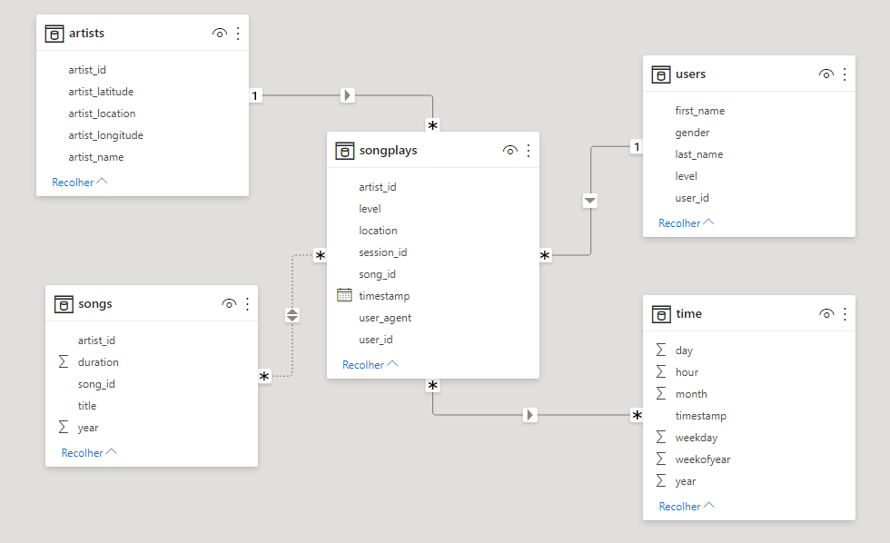

# Data Modeling with Prostgres
This is the first project from Nanodegree Data Engineering from Udacity. The project aims to create an ETL (Extract, Transform and Load) pipeline for the analysis proposals in a startup called Sparkfy.

## Data
The data we use is available in two different repositories: `./data/log_data/` and `./data/song_data/`.

## Song Data 
The Song Dataset has the following layout:
```json
    {
        "num_songs": 1,
        "artist_id": "ARD7TVE1187B99BFB1", 
        "artist_latitude": null, 
        "artist_longitude": null, 
        "artist_location": "California - LA", 
        "artist_name": "Casual", 
        "song_id": "SOMZWCG12A8C13C480", 
        "title": "I Didn't Mean To", 
        "duration": 218.93179, 
        "year": 0
    }
```
It contains information about song and artist of that song.

## Log Data 
The Log Dataset has the following layout:
```json
    {
        "num_songs": 1,
        "artist_id": "ARD7TVE1187B99BFB1", 
        "artist_latitude": null, 
        "artist_longitude": null, 
        "artist_location": "California - LA", 
        "artist_name": "Casual", 
        "song_id": "SOMZWCG12A8C13C480", 
        "title": "I Didn't Mean To", 
        "duration": 218.93179, 
        "year": 0
    }
```
This dataset contains information about activity logs from the music app.

## Data Modeling
During the process 5 tables will be created by `create_tables.py` script. The tables need to be modeling to fit the business need about the information we have. Thinking about that the database modeling was developed using Fact (`songplays`) and Dimension (`artists, users, songs, time`) tables.



## How run the project?
### Database (Postgres)
First of all we need create a Postgres instance using Docker.

Pull the Postgres Docker Image:
```console
$ docker pull postgres
```
Create a container called `db_postgres_student` given the Postgres user, password and database name as environment variables:
```console
$ docker run --name db_postgres_student -e POSTGRES_USER=student -e POSTGRES_PASSWORD=student -e POSTGRES_DB=studentdb -p 5432:5432 -d postgres
```

### ETL
After that, clone this GIT repository into your local machine and install the requirements libraries using:
```console
$ pip install -r requirements.txt
```
Now, the environment is ready! 
First you must execute the follow script:
```console
$ python3 create_tables.py
```
It will create all the database and tables needed to run the ETL process for Sparkfy. Than, we need to run the scripty responsible for the ETL:
```console
$ python3 etl.py
```
This command starts the ETL process and gather data from `./data/log_data/` and `./data/song_data/` to store them in Postgres database based on the database modeling presented.
Last, but not least we should run `test.ipynb` to take the query results and to confirm whether the process have worked.